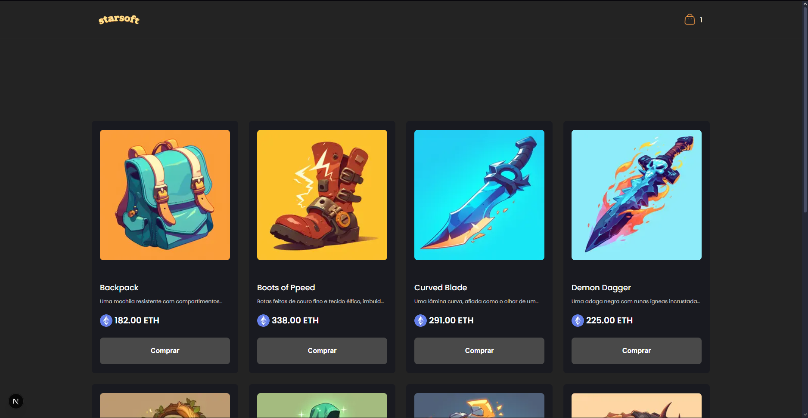
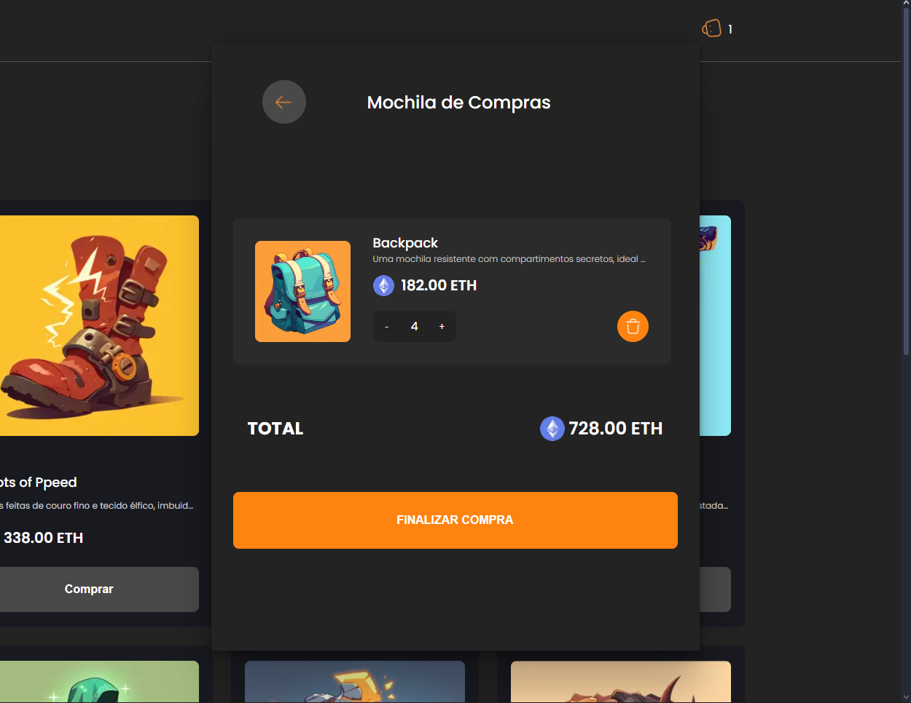
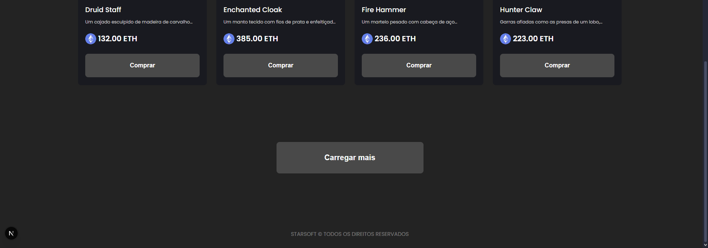

# Desafio Frontend StarSoft - NFT Marketplace

Este é um projeto de frontend para um marketplace de NFTs, desenvolvido utilizando Next.js e TypeScript.

O ambiente de desenvolvimento é totalmente containerizado com Docker, garantindo uma configuração rápida, consistente e isolada.

## 🖼️ Telas da Aplicação

Aqui estão algumas telas do frontend da aplicação:

| Home | Carrinho de Produtos |
| :---: | :---: |
|  |  |

| Card NFT | Botão "Carregar main" |
| :---: | :---: |
|  |  |


## ✨ Funcionalidades Implementadas

*   **Listagem e Exibição de NFTs:** Apresentação de uma coleção de NFTs com detalhes como nome, preço e descrição.
*   **Carrinho de Compras:** Funcionalidade completa para adicionar, remover e visualizar NFTs no carrinho através de um modal intuitivo.
*   **Animações e Interatividade:** Utilização da biblioteca `framer-motion` para transições de interface fluidas, loaders (`Spinner`) e interações dinâmicas, como a exibição da descrição completa do NFT ao passar o mouse sobre o card.
*   **Gestão de Estado:** Gerenciamento eficiente do estado global da aplicação, especialmente do carrinho de compras, utilizando Redux Toolkit.
*   **Rotas Dinâmicas:** Estrutura de roteamento baseada em páginas para uma navegação clara e escalável.

## ⚙️ Tecnologias Utilizadas

*   **Next.js**: Framework React para desenvolvimento web de alto desempenho, oferecendo Server-Side Rendering (SSR) e Static Site Generation (SSG), roteamento e otimizações de imagem para uma experiência de usuário rápida e eficiente.
*   **React**: Biblioteca JavaScript declarativa para a construção de interfaces de usuário reativas e componentizadas.
*   **TypeScript**: Superset de JavaScript que adiciona tipagem estática ao código, resultando em maior robustez, detecção precoce de erros e melhor manutenibilidade.
*   **Jest**: Framework de testes JavaScript amplamente utilizado para garantir a qualidade e a confiabilidade do código através de testes unitários e de integração.
*   **Redux Toolkit**: Conjunto de ferramentas oficial para simplificar o desenvolvimento com Redux, facilitando o gerenciamento de estado global e a escrita de lógica de redução previsível.
*   **Framer Motion**: Uma biblioteca poderosa e fácil de usar para criar animações fluidas e interativas em interfaces React, aprimorando a experiência visual do usuário.
*   **Sass/SCSS Modules**: Pré-processador CSS que permite o uso de variáveis, mixins, funções e aninhamento, combinado com CSS Modules para escopo local de estilos, garantindo organização e evitando conflitos.
*   **Docker e Docker Compose**: Plataformas de containerização que garantem um ambiente de desenvolvimento isolado, consistente e de fácil configuração, eliminando problemas de "funciona na minha máquina".

## 📡 Como Executar o Projeto

Antes de iniciar o projeto, certifique-se de configurar as variáveis de ambiente necessárias. Este projeto utiliza variáveis para configurar a URL da API e outras configurações importantes.

1.  **Variáveis de Ambiente:**
    *   Crie um arquivo `.env.local` na raiz do projeto.
    *   Consulte o arquivo `.env.example` para identificar as variáveis necessárias e seus formatos esperados.
    *   Preencha o arquivo `.env.local` com os valores correspondentes ao seu ambiente.

Para executar a aplicação, você precisará ter o **Docker** e o **Docker Compose** instalados em sua máquina.

### Com Docker (Recomendado)

1.  Clone este repositório:
    ```bash
    git clone https://github.com/seu-usuario/starsoft-frontend-challenge.git
    cd starsoft-frontend-challenge
    ```
2.  Na raiz do projeto, execute o seguinte comando para construir a imagem Docker e iniciar o container em modo detached (-d):
    ```bash
    docker-compose up --build -d
    ```
3.  Após o processo ser finalizado, a aplicação estará disponível no seu navegador em:
    [http://localhost:3000](http://localhost:3000)

### Sem Docker (Alternativo)

1.  Clone este repositório:
    ```bash
    git clone https://github.com/seu-usuario/starsoft-frontend-challenge.git
    cd starsoft-frontend-challenge
    ```
2.  Instale as dependências do projeto:
    ```bash
    npm install
    ```
3.  Inicie o servidor de desenvolvimento:
    ```bash
    npm run dev
    ```
4.  A aplicação estará disponível em:
    [http://localhost:3000](http://localhost:3000)

## Como Parar a Aplicação

### Com Docker
Para parar os containers, execute o comando abaixo na raiz do projeto:
```bash
docker-compose down
```

### Sem Docker
Para parar o servidor de desenvolvimento, pressione `Ctrl + C` no terminal onde ele está sendo executado.

## Possíveis Limitações e Melhorias Futuras

*   **Autenticação de Usuário:** Implementar um sistema de autenticação e autorização para usuários, permitindo funcionalidades personalizadas, como histórico de compras e gerenciamento de coleções.
*   **Filtros e Ordenação Avançados:** Adicionar opções de filtragem (por preço, categoria, artista, status) e ordenação para a lista de NFTs, aprimorando a capacidade de descoberta.
*   **Processo de Checkout Completo:** Expandir a funcionalidade do carrinho para um fluxo de checkout completo, incluindo detalhes de pagamento e confirmação de transação.
*   **Otimização para Dispositivos Móveis:** Embora o projeto já seja responsivo em certa medida, otimizações adicionais e testes em uma gama maior de dispositivos móveis podem aprimorar ainda mais a experiência em telas menores.
*   **Testes End-to-End (E2E):** Implementar testes E2E com ferramentas como Cypress ou Playwright para garantir a integridade e o fluxo completo da aplicação.
*   **Internacionalização (i18n):** Adicionar suporte a múltiplos idiomas para tornar a aplicação acessível a um público global.